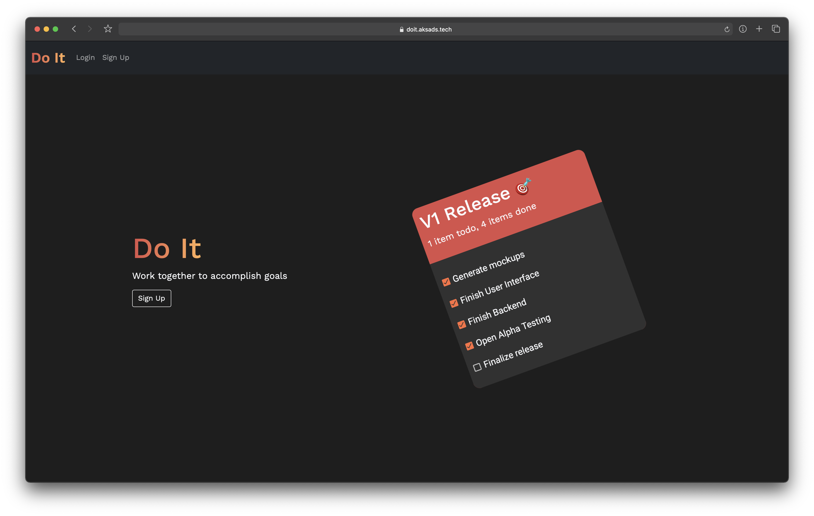
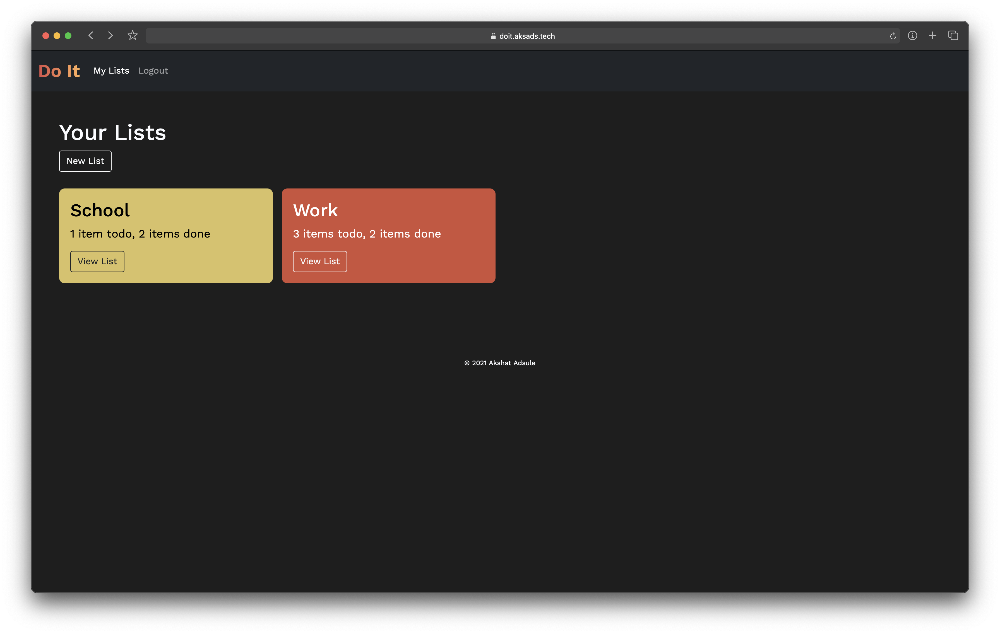
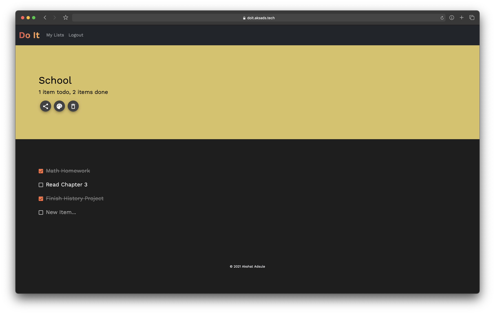

# Doit - Work together to accomplish goals

Doit is a platform that allows teams and individuals plan out, manage, and achieve their tasks and goals.

### Features

- Real time synchronized editing
- Share lists
- Notifications (Coming soon)

### Screenshots

!

